 

## ✨ About me

Lateral-entry B.Tech CSE student at Shiv Nadar University (batch of 2027), focused on AI and Data Science. I like turning ideas into things that actually run: LLM agents, simulators, search systems and a bit of hardware. I solve problems on LeetCode in C++ and prefer a clean mathematical approach over brute force.

<b>🌱 What I'm up to right now</b> (click to open)

 

* 🏎️ Polishing **F1 Strategist**, an LLM agent that calls pit-wall strategy, for the Meta PyTorch OpenEnv Hackathon
* 💧 Building **Virtual Tank Battery** for the Schneider grid-reliability challenge (hardware and firmware)
* ⚖️ Hacking on **LexShift**, legal search over Supreme Court judgments, for an IR hackathon
* 🩺 Working on **TG-LiteNet**, retinal vessel segmentation for my project course

<b>🎯 Quick facts</b> (click to open)

 

* I train models with GRPO and enjoy reward design more than I should
* Most comfortable in Python and C++, happy in React when a UI is needed
* Hackathons are my favourite way to learn fast
* Ask me about RL environments, simulators or competitive programming

## 🧰 Toolbox

## 🚀 Things I've built

<table align="center">
<tr>
<td></td>
<td></td>
</tr>
<tr>
<td></td>
<td></td>
</tr>
<tr>
<td></td>
<td></td>
</tr>
</table>

## 🏁 Contribution Grand Prix

Every segment of the track is one day of the last year. A GitHub Action redraws it every 12 hours.

## 📊 Stats

 

Pastel, animated and kept fresh by GitHub Actions 🌸

